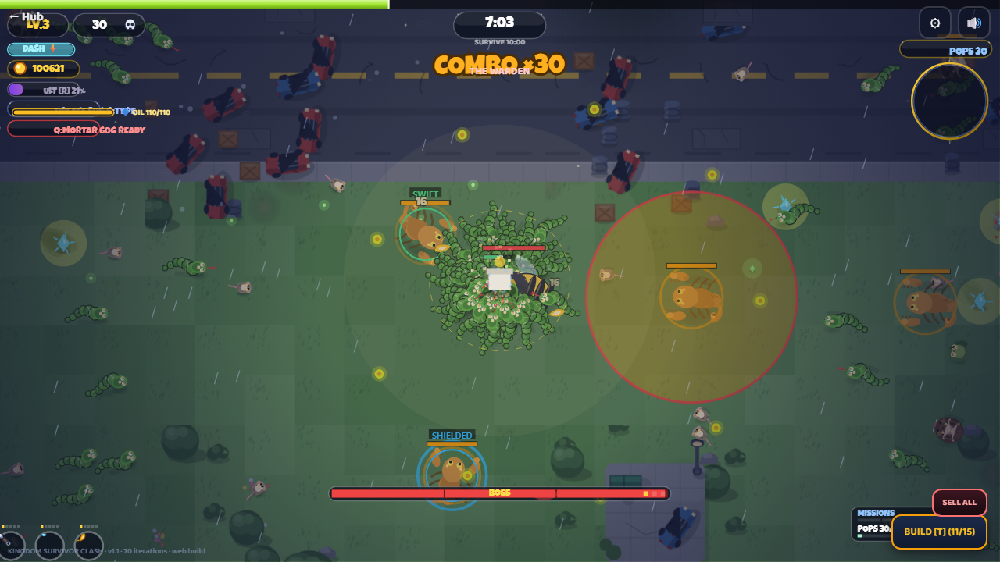
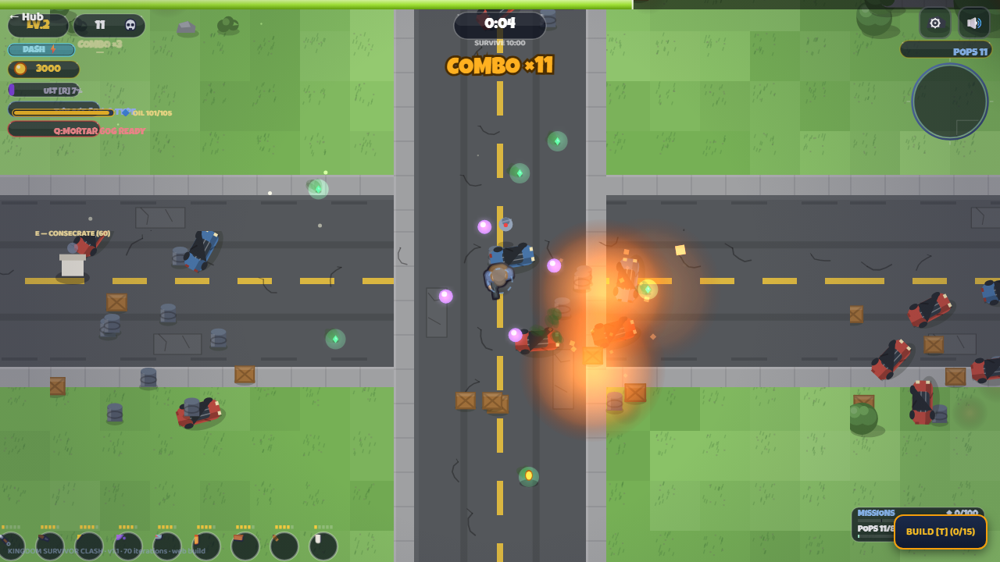
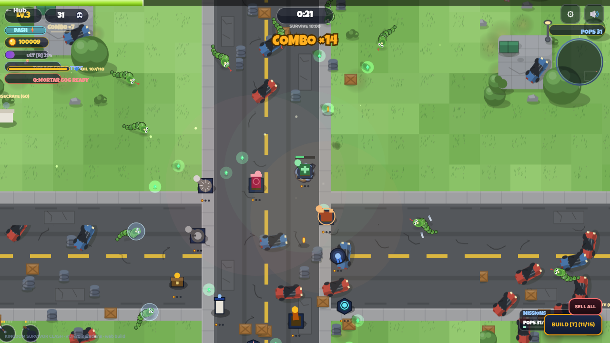
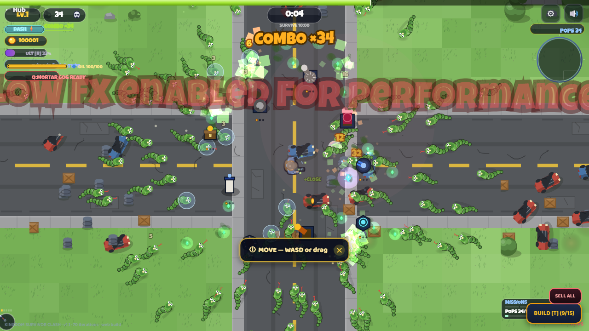

# PROOF — Kingdom Survivor Clash (web build)

Generated 2026-09-06T19:46:38 · wall 709s · modules: g1, g2, g3, g4, g5, g6, g7, g8, g9

**VERDICT: ALL PASS**

## g1

| check | status | detail |
|---|---|---|
| run starts | PASS |  |
| tower ring placed (11 types + merge fodder) | PASS | placed 14 |
| oil upgrades reach T3 | PASS | 14 towers at T3 |
| PARAGON T4 merge | PASS | {'t4': 0, 't5': 1} |
| GLORY T5 merge | PASS | {'t4': 0, 't5': 1} |
| altar consecrated via E | PASS | 1 on |
| boss spawns: Spud the Unruly | PASS | {'hp': 936, 'max': 936, 'layers': None, 'sh': None, 'x': 2964} |
| boss killable: Spud the Unruly | PASS |  |
| boss spawns: Baron Burrito | PASS | {'hp': 931, 'max': 931, 'layers': None, 'sh': None, 'x': 3149} |
| boss killable: Baron Burrito | PASS |  |
| boss spawns: Sir Peel-a-Lot | PASS | {'hp': 1505, 'max': 1505, 'layers': None, 'sh': None, 'x': 3120} |
| boss killable: Sir Peel-a-Lot | PASS |  |
| boss spawns: Lord Glaze | PASS | {'hp': 2583, 'max': 2625, 'layers': None, 'sh': None, 'x': 1828} |
| boss killable: Lord Glaze | PASS |  |
| boss spawns: Count Patty | PASS | {'hp': 3718, 'max': 3990, 'layers': 3, 'sh': None, 'x': 1942} |
| boss killable: Count Patty | PASS |  |
| kills accrued | PASS | 30 kills |
| zero page errors | PASS | [] |
## g2

| check | status | detail |
|---|---|---|
| mode runs clean: casual | PASS | state=play kills=2 errs=0 |
| mode runs clean: normal | PASS | state=play kills=2 errs=0 |
| mode runs clean: nightmare | PASS | state=play kills=2 errs=0 |
| mode runs clean: ironman | PASS | state=play kills=1 errs=0 |
| mode runs clean: ngplus | PASS | state=play kills=2 errs=0 |
| mode runs clean: weekly | PASS | state=play kills=1 errs=0 |
| mode runs clean: echo | PASS | state=play kills=0 errs=0 |
| endless KEEP GOING works | PASS | True/clicked/play |
| endless zero errors | PASS | [] |
## g3

| check | status | detail |
|---|---|---|
| hero roster >= 6 | PASS | ['survivor', 'soldier', 'scout', 'medic', 'engi', 'crimson'] |
| hero kills: survivor | PASS | kills=19 errs=0 |
| hero kills: soldier | PASS | kills=21 errs=0 |
| hero kills: scout | PASS | kills=19 errs=0 |
| hero kills: medic | PASS | kills=17 errs=0 |
| hero kills: engi | PASS | kills=16 errs=0 |
| hero kills: crimson | PASS | kills=18 errs=0 |
## g4

| check | status | detail |
|---|---|---|
| weapon fires: Kunai | PASS | tag dmg=90 (other=46) |
| weapon fires: Shotgun | PASS | tag dmg=156 (other=275) |
| weapon fires: Lightning | PASS | tag dmg=662 (other=57) |
| weapon fires: ForceField | PASS | tag dmg=272 (other=69) |
| weapon fires: Guardian | PASS | tag dmg=291 (other=117) |
| weapon fires: Molotov | PASS | tag dmg=108 (other=243) |
| weapon fires: Brick | PASS | tag dmg=337 (other=109) |
| weapon fires: Baseball Bat | PASS | tag dmg=363 (other=182) |
| weapon fires: Katana | PASS | tag dmg=610 (other=82) |
| weapon fires: Void Power | PASS | tag dmg=286 (other=104) |
| weapon fires: RPG | PASS | tag dmg=899 (other=101) |
| weapon fires: Orbit Blades | PASS | tag dmg=342 (other=94) |
| weapon fires: Chain Lightning | PASS | tag dmg=334 (other=68) |
| weapon fires: Boomerang | PASS | tag dmg=235 (other=128) |
| weapon fires: Frost Nova | PASS | tag dmg=364 (other=129) |
| zero page errors | PASS | [] |
## g5

| check | status | detail |
|---|---|---|
| tower damage: gatling | PASS | 42 dmg |
| tower damage: tesla | PASS | 53 dmg |
| tower damage: mortar | PASS | 190 dmg |
| tower damage: tack | PASS | 35 dmg |
| tower damage: watch | PASS | 42 dmg |
| tower damage: pitch | PASS | 24 dmg |
| tower damage: spike | PASS | 80 dmg |
| tithe generates silver | PASS | +2 |
| apothecary heals hero | PASS | +5 hp |
| town crier aura applies | PASS | {'crierAura': True} |
| zero page errors | PASS | [] |
## g6

| check | status | detail |
|---|---|---|
| Spud spawns | PASS | {'hp': 937, 'max': 937, 'layers': None, 'sh': None, 'x': 2041} |
| Spud splits at 50% | PASS | 6 split spawns |
| Peel-a-Lot spawns | PASS | {'hp': 1505, 'max': 1505, 'layers': None, 'sh': None, 'x': 2200} |
| Peel teleports | PASS | {'hp': 1505, 'max': 1505, 'layers': None, 'sh': None, 'x': 2200}->{'x': 1629, 'y': 1236} |
| Lord Glaze spawns | PASS | {'hp': 2639, 'max': 2639, 'layers': None, 'sh': None, 'x': 2253} |
| Glaze regenerates | PASS | 2111->2243 |
| Watchtower melts Glaze | PASS | {'melt': 3.75, 'gone': False, 'tower': False, 'dist': None, 'state': 'over', 'tw': 1} |
| Count Patty spawns | PASS | {'hp': 3618, 'max': 3618, 'layers': 3, 'sh': None, 'x': 949} |
| Patty layer pops | PASS | 3->1 |
| Fizzbeelzebub spawns | PASS | {'hp': 4158, 'max': 4158, 'layers': None, 'sh': 80, 'x': 963} |
| Fizz shield absorbs | PASS | 80->74 |
| spawns: Baron Burrito | PASS | {'hp': 931, 'max': 931, 'layers': None, 'sh': None, 'x': 2261} |
| royal loot: Baron Burrito | PASS | +150 silver |
| spawns: Grainlord Crisp | PASS | {'hp': 5436, 'max': 5436, 'layers': None, 'sh': None, 'x': 2208} |
| royal loot: Grainlord Crisp | PASS | +150 silver |
| spawns: Fizzbeelzebub | PASS | {'hp': 703, 'max': 703, 'layers': None, 'sh': 80, 'x': 2271} |
| royal loot: Fizzbeelzebub | PASS | +150 silver |
| zero page errors | PASS | [] |
## g7

| check | status | detail |
|---|---|---|
| 120-entity scene | PASS | 91 enemies live |
| FPS >= 10 headless (software raster; GPU browsers far higher) | PASS | 11 fps headless |
| zero page errors under load | PASS | [] |
## g8

| check | status | detail |
|---|---|---|
| save keys discovered | PASS | 7 keys |
| corrupt-save boot: survivorSaveVer | PASS | menu=True errs=0 |
| corrupt-save boot: survivorGold | PASS | menu=True errs=0 |
| corrupt-save boot: survivorHero | PASS | menu=True errs=0 |
| corrupt-save boot: survivorDaily | PASS | menu=True errs=0 |
| corrupt-save boot: survivorMeta | PASS | menu=True errs=0 |
| corrupt-save boot: survivorPerks | PASS | menu=True errs=0 |
| corrupt-save boot: survivorAchievements | PASS | menu=True errs=0 |
| monkey test survives | PASS | state=play errs=0 |
## g9

| check | status | detail |
|---|---|---|
| soak run 1 clean | PASS | kills=13 errs=0 |
| soak run 2 clean | PASS | kills=13 errs=0 |
| soak run 3 clean | PASS | kills=15 errs=0 |

## Screenshots

---
94 checks · 0 failed