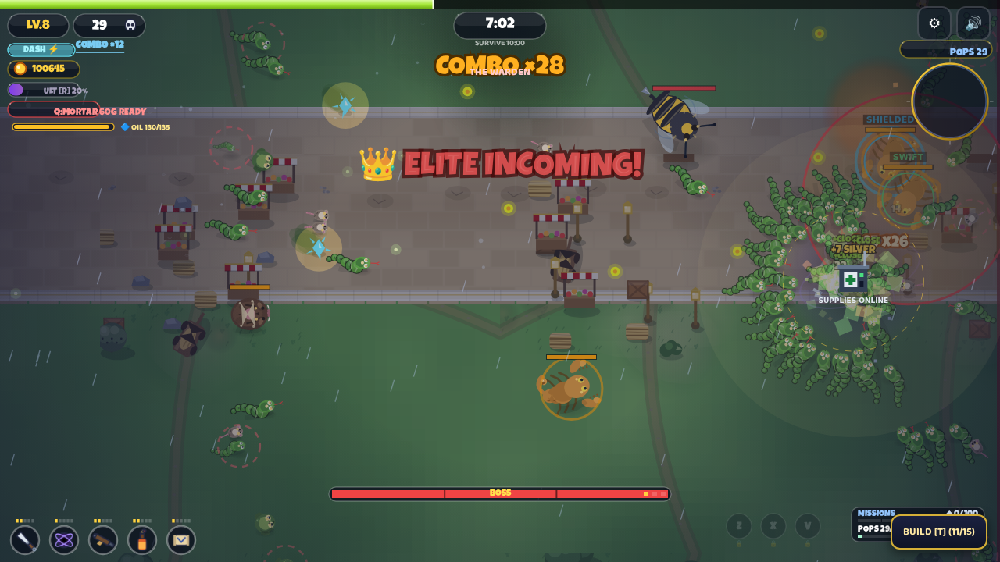
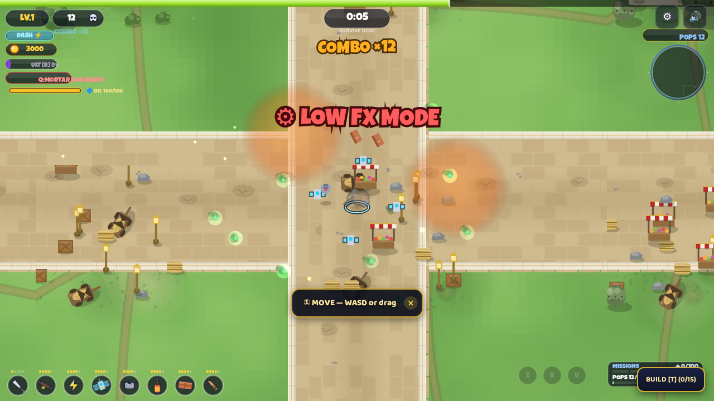
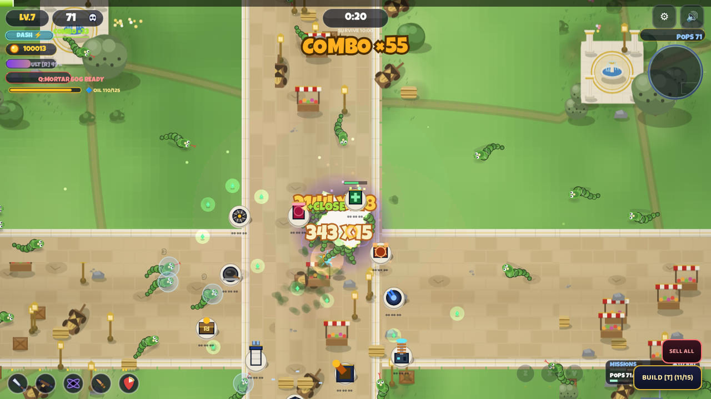
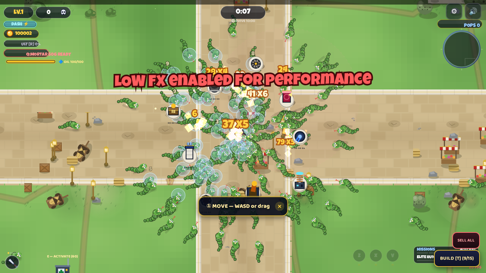

# PROOF — Kingdom Survivor Clash (web build)

Generated 2026-09-29T12:58:57 · wall 671s · modules: g1, g2, g3, g4, g5, g6, g7, g8, g9

**VERDICT: ALL PASS**

## g1

| check | status | detail |
|---|---|---|
| run starts | PASS |  |
| tower ring placed (11 types + merge fodder) | PASS | placed 14 |
| oil upgrades reach T3 | PASS | 14 towers at T3 |
| PARAGON T4 merge | PASS | {'t4': 0, 't5': 1} |
| GLORY T5 merge | PASS | {'t4': 0, 't5': 1} |
| field station activated via E | PASS | 1 on |
| boss spawns: Spud the Unruly | PASS | {'hp': 936, 'max': 936, 'layers': None, 'sh': None, 'x': 3405} |
| boss killable: Spud the Unruly | PASS |  |
| boss spawns: Baron Burrito | PASS | {'hp': 882, 'max': 931, 'layers': None, 'sh': None, 'x': 2070} |
| boss killable: Baron Burrito | PASS |  |
| boss spawns: Sir Peel-a-Lot | PASS | {'hp': 1506, 'max': 1506, 'layers': None, 'sh': None, 'x': 2111} |
| boss killable: Sir Peel-a-Lot | PASS |  |
| boss spawns: Lord Glaze | PASS | {'hp': 2583, 'max': 2627, 'layers': None, 'sh': None, 'x': 2094} |
| boss killable: Lord Glaze | PASS |  |
| boss spawns: Count Patty | PASS | {'hp': 3333, 'max': 3603, 'layers': 3, 'sh': None, 'x': 2111} |
| boss killable: Count Patty | PASS |  |
| kills accrued | PASS | 29 kills |
| zero page errors | PASS | [] |
## g2

| check | status | detail |
|---|---|---|
| mode runs clean: casual | PASS | state=play kills=2 errs=0 |
| mode runs clean: normal | PASS | state=play kills=2 errs=0 |
| mode runs clean: nightmare | PASS | state=play kills=1 errs=0 |
| mode runs clean: ironman | PASS | state=play kills=1 errs=0 |
| mode runs clean: ngplus | PASS | state=play kills=1 errs=0 |
| mode runs clean: weekly | PASS | state=play kills=2 errs=0 |
| mode runs clean: echo | PASS | state=play kills=1 errs=0 |
| endless KEEP GOING works | PASS | True/clicked/play |
| endless zero errors | PASS | [] |
## g3

| check | status | detail |
|---|---|---|
| hero roster >= 6 | PASS | ['survivor', 'soldier', 'scout', 'medic', 'engi', 'crimson'] |
| hero kills: survivor | PASS | kills=31 errs=0 |
| hero kills: soldier | PASS | kills=22 errs=0 |
| hero kills: scout | PASS | kills=21 errs=0 |
| hero kills: medic | PASS | kills=19 errs=0 |
| hero kills: engi | PASS | kills=18 errs=0 |
| hero kills: crimson | PASS | kills=19 errs=0 |
## g4

| check | status | detail |
|---|---|---|
| weapon fires: Kunai | PASS | tag dmg=124 (other=3867) |
| weapon fires: Shotgun | PASS | tag dmg=136 (other=210) |
| weapon fires: Orbital Discharger | PASS | tag dmg=541 (other=92) |
| weapon fires: ForceField | PASS | tag dmg=265 (other=164) |
| weapon fires: Guardian | PASS | tag dmg=221 (other=120) |
| weapon fires: Molotov | PASS | tag dmg=217 (other=105) |
| weapon fires: Brick | PASS | tag dmg=379 (other=178) |
| weapon fires: Baseball Bat | PASS | tag dmg=332 (other=178) |
| weapon fires: Katana | PASS | tag dmg=436 (other=131) |
| weapon fires: Gravity Projector | PASS | tag dmg=303 (other=68) |
| weapon fires: RPG | PASS | tag dmg=307 (other=199) |
| weapon fires: Orbit Blades | PASS | tag dmg=372 (other=94) |
| weapon fires: Arc Discharger | PASS | tag dmg=269 (other=103) |
| weapon fires: Boomerang | PASS | tag dmg=428 (other=145) |
| weapon fires: Cryo Emitter | PASS | tag dmg=332 (other=144) |
| zero page errors | PASS | [] |
## g5

| check | status | detail |
|---|---|---|
| tower damage: gatling | PASS | 330 dmg |
| tower damage: tesla | PASS | 507 dmg |
| tower damage: mortar | PASS | 2873 dmg |
| tower damage: tack | PASS | 356 dmg |
| tower damage: watch | PASS | 561 dmg |
| tower damage: pitch | PASS | 540 dmg |
| tower damage: spike | PASS | 800 dmg |
| tithe generates silver | PASS | +5 |
| apothecary heals hero | PASS | +35 hp |
| town crier support zone applies | PASS | {'crierAura': True} |
| zero page errors | PASS | [] |
## g6

| check | status | detail |
|---|---|---|
| Spud spawns | PASS | {'hp': 925, 'max': 936, 'layers': None, 'sh': None, 'x': 1162} |
| Spud splits at 50% | PASS | 6 split spawns |
| Peel-a-Lot spawns | PASS | {'hp': 2313, 'max': 2313, 'layers': None, 'sh': None, 'x': 927} |
| Peel teleports | PASS | {'hp': 2313, 'max': 2313, 'layers': None, 'sh': None, 'x': 927}->{'x': 1626, 'y': 1256} |
| Lord Glaze spawns | PASS | {'hp': 2638, 'max': 2638, 'layers': None, 'sh': None, 'x': 2268} |
| Glaze regenerates | PASS | 1583->1728 |
| Watchtower melts Glaze | PASS | {'melt': 3.75, 'gone': False, 'tower': True, 'dist': 31, 'state': 'play', 'tw': 1} |
| Count Patty spawns | PASS | {'hp': 3616, 'max': 3616, 'layers': 3, 'sh': None, 'x': 2300} |
| Patty layer pops | PASS | 3->2 |
| Captain Fizz spawns | PASS | {'hp': 4157, 'max': 4157, 'layers': None, 'sh': 80, 'x': 2300} |
| Fizz shield absorbs | PASS | 80->74 |
| spawns: Baron Burrito | PASS | {'hp': 931, 'max': 931, 'layers': None, 'sh': None, 'x': 931} |
| royal loot: Baron Burrito | PASS | +150 silver |
| spawns: Grainlord Crisp | PASS | {'hp': 5434, 'max': 5434, 'layers': None, 'sh': None, 'x': 900} |
| royal loot: Grainlord Crisp | PASS | +150 silver |
| spawns: Captain Fizz | PASS | {'hp': 4156, 'max': 4156, 'layers': None, 'sh': 80, 'x': 2200} |
| royal loot: Captain Fizz | PASS | +150 silver |
| zero page errors | PASS | [] |
## g7

| check | status | detail |
|---|---|---|
| 120-entity scene | PASS | 129 enemies live |
| FPS >= 10 headless (software raster; GPU browsers far higher) | PASS | 22 fps headless |
| zero page errors under load | PASS | [] |
## g8

| check | status | detail |
|---|---|---|
| save keys discovered | PASS | 7 keys |
| corrupt-save boot: survivorSaveVer | PASS | menu=True errs=0 |
| corrupt-save boot: survivorGold | PASS | menu=True errs=0 |
| corrupt-save boot: survivorHero | PASS | menu=True errs=0 |
| corrupt-save boot: survivorDaily | PASS | menu=True errs=0 |
| corrupt-save boot: survivorMeta | PASS | menu=True errs=0 |
| corrupt-save boot: survivorPerks | PASS | menu=True errs=0 |
| corrupt-save boot: survivorAchievements | PASS | menu=True errs=0 |
| monkey test survives | PASS | state=play errs=0 |
## g9

| check | status | detail |
|---|---|---|
| soak run 1 clean | PASS | kills=49 errs=0 |
| soak run 2 clean | PASS | kills=71 errs=0 |
| soak run 3 clean | PASS | kills=237 errs=0 |

## Screenshots

---
94 checks · 0 failed